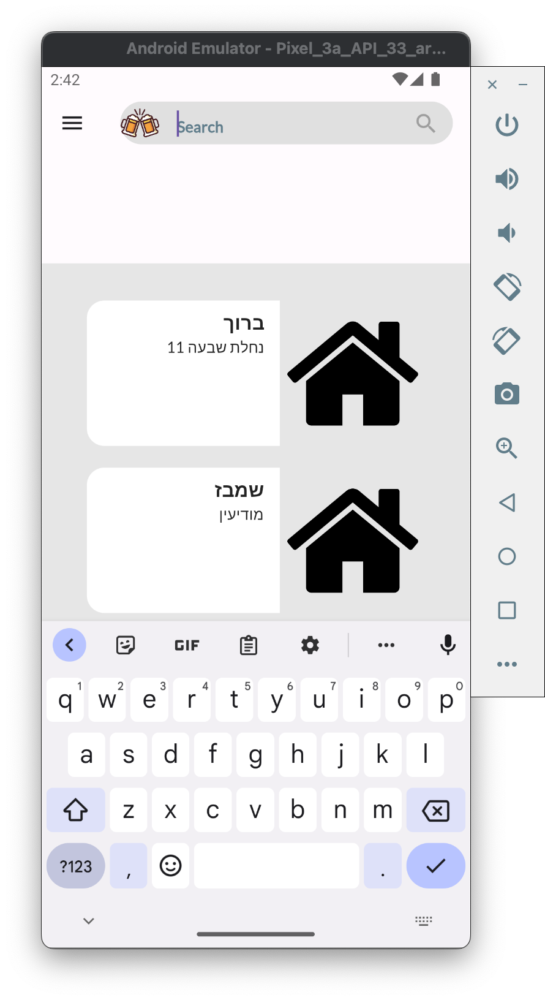

# every_bar_app

Welcome to EveryBar app, a nightlife Finder. A Flutter-based mobile application designed to help users discover nearby bars, clubs, and parties based on their current location. The app also allows business owners to register and list their venues to attract more customers.

Features

Location-Based Search: Find nearby nightlife spots such as bars, clubs, and parties based on your current location.
Business Registration: Owners can register and list their nightlife venues, providing details like address, operating hours, and events.
User-Friendly Interface: Simple and intuitive UI for both users searching for nightlife and business owners managing their listings.
Favorites: Users can save their favorite spots for quick access.
Reviews and Ratings: View and leave reviews and ratings for venues.

****THE APP IS STILL IN PROGRESS****

